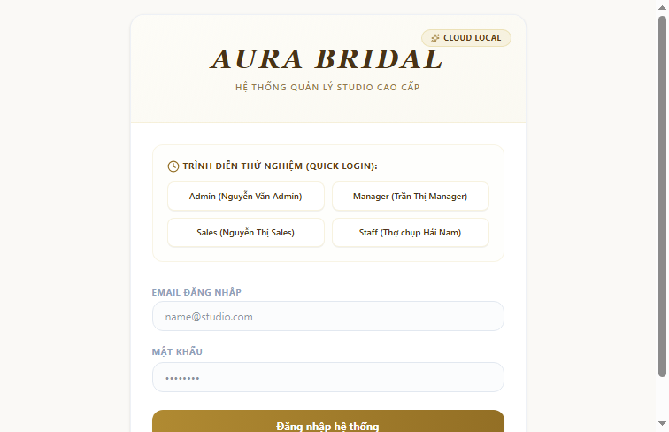

# 🌟 Hệ thống Quản lý Studio Ảnh Cưới - STUDIO V2
**Dự án Quản lý Hoạt động Nội bộ cho "The Will Studio" / "Aura Bridal Studio"**

Ứng dụng **STUDIO V2** là giải pháp quản lý toàn diện được thiết kế đặc thù cho các hoạt động của Studio chụp ảnh cưới tại Rạch Giá. Ứng dụng hoạt động mượt mà trên cả máy tính (Desktop) lẫn điện thoại di động (Mobile Web-App), giúp chuẩn hóa quy trình tiếp đón khách hàng, theo dõi hợp đồng cưới, phân công công việc cho nhân sự và đo lường mục tiêu kinh doanh.



---

## 📋 Mục lục
1. [Tính năng cốt lõi](#-tính-năng-cốt-lõi)
2. [Công nghệ sử dụng](#-công-nghệ-sử-dụng)
3. [Cấu trúc thư mục dự án](#-cấu-trúc-thư-mục-dự-án)
4. [Hướng dẫn cài đặt & Chạy dưới local](#-hướng-dẫn-cài-đặt--chạy-dưới-local)
5. [Quy trình Đóng gói (Build) & Triển khai (Deploy)](#-quy-trình-đóng-gói-build--triển-khai-deploy)
6. [Tài liệu & Báo cáo đi kèm](#-tài-liệu--báo-cáo-đi-kèm)

---

## 🚀 Tính năng cốt lõi

Ứng dụng hỗ trợ toàn diện các nghiệp vụ của một studio ảnh cưới chuyên nghiệp:

| Phân hệ chức năng | Mô tả chi tiết | Giao diện hỗ trợ |
| :--- | :--- | :--- |
| **CRM & Khách hàng** | Lưu trữ danh bạ cô dâu - chú rể, thông tin ngày cưới, số điện thoại, lịch sử liên hệ. | Desktop + Mobile |
| **Quản lý Hợp đồng / Đơn hàng** | Tạo mới đơn hàng dịch vụ cưới (trọn gói chụp album, ngày cưới, thuê váy cưới...), theo dõi tình trạng thanh toán (đặt cọc, thanh toán đợt 2, hoàn tất). | Desktop + Mobile |
| **Phân công Tác vụ (Tasks)** | Giao việc chụp ảnh, quay phim, chỉnh sửa ảnh cho từng nhân sự (Photographer, Editor). Nhân viên nhận việc và báo cáo tiến độ trực tiếp. | Desktop + Mobile |
| **Mục tiêu Doanh số (OKR)** | Đặt mục tiêu chỉ tiêu doanh thu, số lượng hợp đồng theo tháng/quý và theo dõi biểu đồ tiến độ hoàn thành trực quan. | Desktop + Mobile |
| **Quản lý Cơ hội (Leads/Sales)** | Ghi nhận thông tin khách hàng tiềm năng đến từ các nguồn (Facebook, người quen giới thiệu) để chăm sóc và chuyển đổi thành hợp đồng chính thức. | Desktop + Mobile |
| **Phân quyền Nhân sự (RBAC)** | Phân quyền 5 vai trò rõ ràng: **Admin** (Xem toàn bộ, quản lý doanh thu), **Manager** (Quản trị vận hành), **Staff** (Lễ tân/tư vấn), **Photographer** (Thợ chụp), **Editor** (Thợ chỉnh ảnh). | Desktop + Mobile |
| **Trò chuyện nội bộ (Chat)** | Nhóm trò chuyện chung toàn studio và các cuộc hội thoại riêng giữa các nhân viên để phối hợp làm việc nhanh chóng. | Desktop + Mobile |
| **Hộp thông báo (Notifications)** | Báo tin tức thời khi nhân viên được phân công tác vụ mới hoặc nhận được tin nhắn từ đồng nghiệp. | Desktop + Mobile |
| **Sao lưu & Khôi phục dữ liệu** | Hỗ trợ tải xuống file backup dạng JSON (`.json`) và khôi phục lại toàn bộ dữ liệu hệ thống chỉ bằng 1 nút bấm từ trang Cài đặt. | Desktop |

---

## 🛠️ Công nghệ sử dụng

Hệ thống được xây dựng trên một Tech Stack hiện đại, gọn nhẹ, dễ cài đặt và bảo trì:

*   **Frontend (Giao diện người dùng):**
    *   **React 19.0.1** (Thư viện UI hiện đại nhất của Facebook).
    *   **Vite 6.2.3** (Bộ công cụ build code siêu tốc).
    *   **Tailwind CSS v4 (4.1.14)** (Framework CSS tối ưu thiết kế nhanh).
    *   **Motion (Framer Motion)** (Xử lý các chuyển động và hiệu ứng vuốt trượt mượt mà trên mobile).
    *   **Recharts** (Vẽ biểu đồ phân tích doanh thu và tiến độ OKR).
    *   **Lucide React** (Bộ thư viện icon giao diện trực quan).
*   **Backend (Máy chủ xử lý):**
    *   **Node.js & Express.js** (Máy chủ viết bằng TypeScript với sự hỗ trợ của `tsx`).
    *   **Prisma ORM (6.2.0)** (Thư viện liên kết cơ sở dữ liệu an toàn và nhất quán).
*   **Database (Cơ sở dữ liệu):**
    *   **Primary DB:** **PostgreSQL** (lưu dữ liệu runtime chính cho production và local development).
    *   **Data Access:** **PostgreSQL Active Cache** qua Prisma, không còn sử dụng `db.json` làm cơ sở dữ liệu chính.

---

## 📁 Cấu trúc thư mục dự án

```
STUDIO V2/
├── package.json                  # Định nghĩa thư viện và lệnh build/run dự án
├── tsconfig.json                 # Cấu hình TypeScript cho dự án
├── server.ts                     # File mã nguồn máy chủ Backend Express (quản lý API & Active Cache)
├── prisma/
│   └── schema.prisma             # Định nghĩa cấu trúc bảng dữ liệu cho PostgreSQL
├── backups/
│   └── backup_*.json             # Các bản sao lưu dữ liệu tự động/thủ công của Studio
├── design/                       # Chứa các bản vẽ phác thảo giao diện (HTML Mockups)
├── src/                          # Thư mục mã nguồn Frontend (React)
│   ├── main.tsx                  # Điểm khởi chạy của ứng dụng React
│   ├── App.tsx                   # Component gốc điều phối giao diện Desktop/Mobile
│   ├── db_service.ts             # Dịch vụ xử lý đọc/ghi dữ liệu cục bộ
│   ├── index.css                 # File cấu hình màu sắc, font chữ và kiểu dáng chung (Tailwind CSS)
│   ├── lib/
│   │   └── api.ts                # Bộ kết nối gọi dữ liệu từ Frontend lên Backend
│   ├── hooks/
│   │   └── useIsMobile.ts        # Hook tự động phát hiện thiết bị di động
│   └── components/               # Các trang giao diện chính
│       ├── Dashboard.tsx         # Bảng tổng quan (Báo cáo doanh số, biểu đồ)
│       ├── Orders.tsx            # Trang Quản lý Đơn hàng/Hợp đồng cưới
│       ├── Tasks.tsx             # Trang Quản lý và Giao việc cho nhân viên
│       ├── Objectives.tsx        # Trang Quản lý mục tiêu OKR của Studio
│       ├── Staff.tsx             # Trang Quản lý & Phân quyền Nhân sự
│       ├── Chat.tsx              # Trang Chat nội bộ toàn Studio
│       └── mobile/               # Bộ giao diện dành riêng cho Điện thoại di động
│           ├── MobileApp.tsx     # Bộ khung ứng dụng di động chính
│           ├── MobileLayout.tsx  # Layout bao ngoài phiên bản di động
│           ├── shared/           # Các nút, thanh điều hướng dùng chung trên điện thoại
│           └── screens/          # 10 Màn hình chức năng tối ưu cho di động
```

---

## 💻 Hướng dẫn cài đặt & Chạy dưới local

### Yêu cầu tiên quyết
*   Đã cài đặt **Node.js** (Khuyến nghị phiên bản v18 trở lên).
*   Đã cài đặt **Git** trên máy tính.

### Các bước khởi chạy cục bộ (Local Development)

1.  **Cài đặt các thư viện phụ thuộc:**
    Mở terminal tại thư mục dự án và chạy:
    ```bash
    npm install
    ```

2.  **Thiết lập file biến môi trường:**
    *   Nhân bản file `.env.example` thành file `.env` ở thư mục gốc.
    *   Điền các thông số kết nối PostgreSQL (`DATABASE_URL`), port chạy server, và các khóa tích hợp nếu dùng.

3.  **Khởi tạo cấu trúc PostgreSQL:**
    Chạy lệnh sau để đồng bộ bảng dữ liệu:
    ```bash
    npx prisma db push
    ```

4.  **Khởi động chế độ nhà phát triển:**
    ```bash
    npm run dev
    ```
    *Lệnh này sẽ khởi chạy đồng thời máy chủ Backend và máy chủ hiển thị giao diện Frontend (Vite).*

5.  **Truy cập ứng dụng:**
    Mở trình duyệt web của bạn và truy cập: [http://localhost:5173](http://localhost:5173)

---

## 📦 Quy trình Đóng gói (Build) & Triển khai (Deploy)

Ứng dụng được thiết kế tương thích đa nền tảng tốt (hỗ trợ phát triển/thử nghiệm trên **Windows** và chạy thực tế trên máy chủ **Linux**).

### 1. Dọn dẹp bản build cũ
```bash
npm run clean
```
*Lệnh này đã được cấu hình chạy an toàn trên cả Windows lẫn Linux để xóa sạch các file build cũ trong thư mục `dist/` mà không gây lỗi dòng lệnh.*

### 2. Đóng gói sản phẩm (Build Production)
```bash
npm run build
```
*Lệnh này sẽ thực hiện song song hai công việc:*
*   Biên dịch và tối ưu hóa toàn bộ mã nguồn Frontend React vào thư mục `dist/assets/`.
*   Sử dụng `esbuild` đóng gói file backend `server.ts` thành một file chạy duy nhất `dist/server.cjs` cực kỳ nhẹ và nhanh.

### 3. Khởi chạy thực tế trên máy chủ (Start Server)
Sau khi build thành công, chạy lệnh sau trên máy chủ (Linux hoặc VPS):
```bash
npm run start
```
Hệ thống sẽ chạy bằng file tối ưu hóa cao `dist/server.cjs` và lắng nghe ở cổng được cấu hình trong file `.env` (mặc định là cổng `5000`).

### 4. Cập nhật Database Schema khi triển khai (Deploy session_version)
Do hệ thống được cập nhật tính năng quản lý phiên đăng nhập an toàn và yêu cầu trường `session_version` trong bảng `User` để xác thực token trên server-side, bạn phải đồng bộ lại cấu hình schema của PostgreSQL trên môi trường production trước khi chạy ứng dụng bằng cách thực thi lệnh:
```bash
npx prisma db push
```

---

## 📘 Tài liệu & Báo cáo đi kèm

Các báo cáo, handoff, spec và mockup HTML cũ không tham gia runtime/build đã được gom vào:

```text
docs/archive/
```
